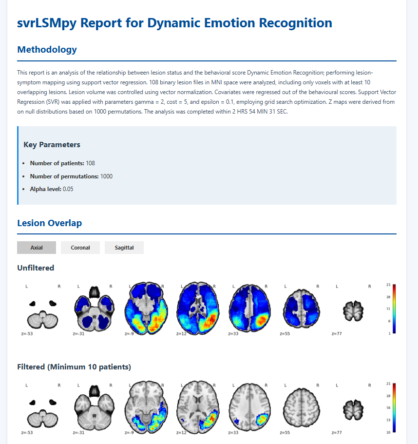
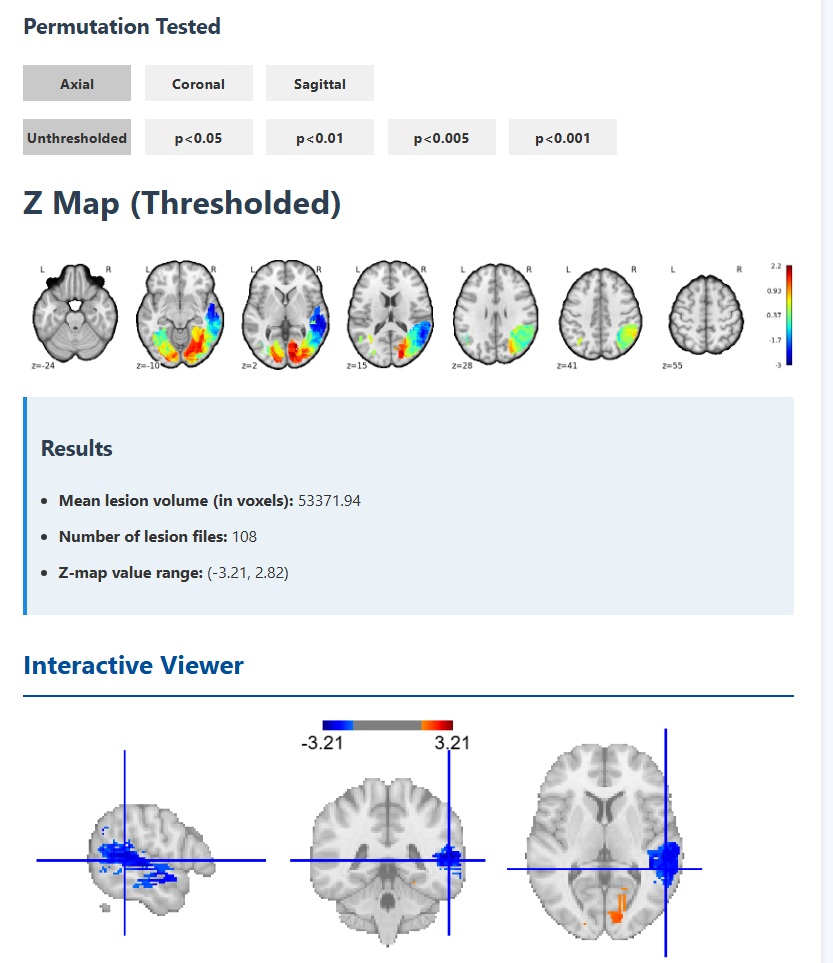

# svrLSMpy
Python package for Lesion Symptom Mapping using Support Vector Regression

## Getting started

Make a folder containing binary lesion files.

Make a csv file (2 mandatory columns, 'filename': containing the full filenames of the binary lesion files, including the file extension i.e. .nii or .nii.gz; and 'behavior' which contains the corresponding behavioral scores of the subject). (Covariates, if any, are in the additional columns)

Example usage:
```
from svrLSMpy import run_svr_lsm_iteration

run_svr_lsm_iteration(
    symptom_folder="lesion/folder/path",
    csv_path="behavioural/score/csv/path/file.csv",
    max_score=37,
    output_path="output/folder"
)
```

Example output:



